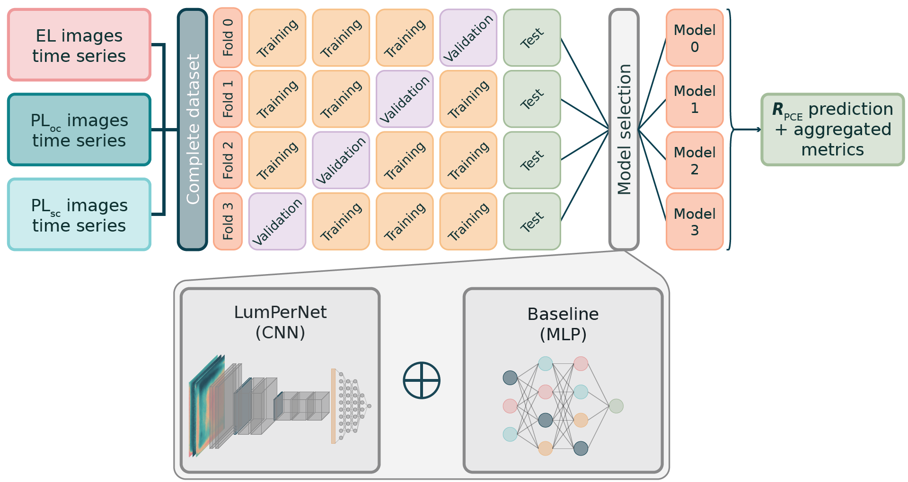

---

##### Related

+ [Paper](https://doi.org/10.48550/arXiv.2603.12857)
+ [GitHub repository](https://github.com/giuliobarl/LumPerNet)

---

##### Abstract

Perovskite solar cells (PSCs) have rapidly gained in power conversion efficiency (PCE) within the last 15 years, providing a promising alternative or add-on to established silicon semiconductors for future’s large-scale photovoltaic (PV) deployment. Yet, besides scalability of fabrication routines, operational stability remains a key bottleneck for commercial roll-out of perovskite based PV. In this context, reliable and fast assessment of the state of health and degradation mechanisms that is compatible with field deployment are of utmost importance. Electrical diagnostics such as current–voltage (J–V) sweeps under illumination provide accurate performance metrics but are time-consuming and do not resolve spatially localized degradation, motivating non-invasive imaging-based alternatives. Here, we present a deep-learning framework to estimate PSC efficiency retention $R_\mathrm{PCE}$ = $\mathrm{PCE_t / PCE_0}$ directly from multimodal luminescence imaging acquired during device aging, and we demonstrate that leveraging spatially resolved luminescence patterns may reveal key to improving prediction performance and robustness compared to intensity-only baselines. In our approach, each learning sample consists of electroluminescence (EL), open-circuit photoluminescence (PLoc), and short-circuit photoluminescence (PLsc) acquired at an aged state together with devicespecific reference images at t = 0, enabling the model to learn degradation-relevant spatial changes relative to the initial condition. These data were acquired over a time span of 5–70 h in an automated, house-built measurement platform. We introduce LumPerNet, a compact convolutional neural network that regresses $R_\mathrm{PCE}$ from stacked multimodal image tensors, and benchmark it against an intensity-only baseline multilayer perceptron regressor. Using a leakageaware evaluation protocol with device-level held-out testing and four-fold cross-validation, and restricting analysis to the operational window $R_\mathrm{PCE} \in [0.8, 1.2]$, LumPerNet achieves a substantially higher and more robust performance ($\mathrm{MAE}: −23.4 \\%, \mathrm{RMSE}: −25.6 \\%, R^2: +0.417$) with respect to the intensity-only baseline, confirming that spatially resolved EL/PL patterns carry predictive information beyond global luminescence decay. To quantify the role of multimodality, we further perform an exhaustive modality ablation study over all single- and paired-modality inputs. We find that multimodal training yields the best generalization, while carefully chosen bimodal configurations can retain most of the full-model performance, whereas other pairings can be unstable across device splits, highlighting that complementary physical contrast, rather than channel count, governs robustness. Representative device trajectories further show temporally coherent $R_\mathrm{PCE}$ estimates and uncertainty quantification via model ensembling. Overall, this work establishes a reproducible pipeline linking automated luminescence imaging to electrical $R_\mathrm{PCE}$ labels, and positions spatially resolved imaging as a practical route for accelerated stability testing and non-invasive degradation monitoring in perovskite photovoltaics.

---

##### Figure 1: The schematic shows the protocol for training the LumPerNet models.



---

##### Citation

Barletta, Giulio, et al.
"Quantifying Perovskite Solar Cell Degradation via Machine Learning from Spatially Resolved Multimodal Luminescence Time Series."
arXiv preprint
arXiv:2603.12857
(2026).
https://doi.org/10.48550/arXiv.2603.12857.

```BibTeX
@article{barletta2026quantifying,
  title={Quantifying Perovskite Solar Cell Degradation via Machine Learning from Spatially Resolved Multimodal Luminescence Time Series},
  author={Barletta, Giulio and Ternes, Simon and Ali, Saif and Abbas, Zohair and Ostendi, Chiara and D'Addio, Marialucia and Magliano, Erica and Asinari, Pietro and Chiavazzo, Eliodoro and Di Carlo, Aldo},
  journal={arXiv preprint arXiv:2603.12857},
  year={2026},
  doi={https://doi.org/10.48550/arXiv.2603.12857}
}
```