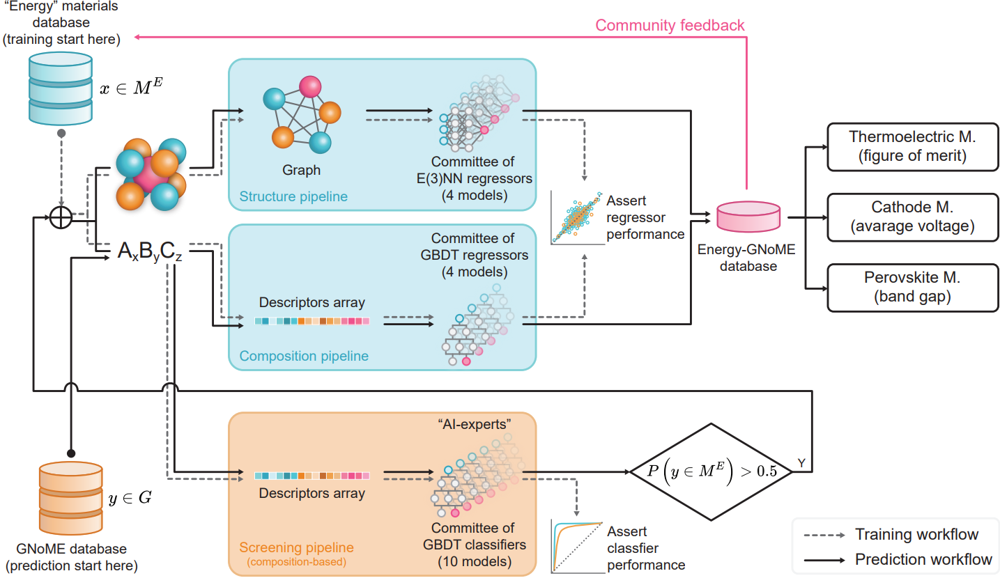

---

##### Related

+ [Paper](https://doi.org/10.1016/j.egyai.2025.100605)
+ [Online interactive database](https://paolodeangelis.github.io/Energy-GNoME/)

---

##### Abstract

Artificial Intelligence (AI) in materials science is driving significant advancements in the discovery of advanced materials for energy applications. The recent GNoME protocol identifies over 380,000 novel stable crystals. From this, we identify over 33,000 materials with potential as energy materials forming the Energy-GNoME database. Leveraging Machine Learning (ML) and Deep Learning (DL) tools, our protocol mitigates cross-domain data bias using feature spaces to identify potential candidates for thermoelectric materials, novel battery cathodes, and novel perovskites. Classifiers with both structural and compositional features identify domains of applicability, where we expect enhanced accuracy of the regressors. Such regressors are trained to predict key materials properties like, thermoelectric figure of merit (zT), band gap (Eg), and cathode voltage (ΔVc). This method significantly narrows the pool of potential candidates, serving as an efficient guide for experimental and computational chemistry investigations and accelerating the discovery of materials suited for electricity generation, energy storage and conversion.

---

##### Figure 1: The schematic shows the protocol for creating the Energy-GNoME database.



---

##### Citation

Paolo De Angelis, Giulio Barletta, Giovanni Trezza, Pietro Asinari, Eliodoro Chiavazzo,
Energy-GNoME: A living database of selected materials for energy applications,
Energy and AI,
Volume 22,
2025,
100605,
ISSN 2666-5468,
https://doi.org/10.1016/j.egyai.2025.100605.

```BibTeX
@article{DEANGELIS2025100605,
    title = {Energy-GNoME: A living database of selected materials for energy applications},
    journal = {Energy and AI},
    volume = {22},
    pages = {100605},
    year = {2025},
    issn = {2666-5468},
    doi = {https://doi.org/10.1016/j.egyai.2025.100605},
    url = {https://www.sciencedirect.com/science/article/pii/S2666546825001375},
    author = {Paolo {De Angelis} and Giulio Barletta and Giovanni Trezza and Pietro Asinari and Eliodoro Chiavazzo},
    keywords = {Energy materials, Artificial Intelligence, Machine Learning, Deep Learning, Thermoelectric, Battery, Perovskite},
    abstract = {Artificial Intelligence (AI) in materials science is driving significant advancements in the discovery of advanced materials for energy applications. The recent GNoME protocol identifies over 380,000 novel stable crystals. From this, we identify over 38,500 materials with potential as energy materials forming the core of the Energy-GNoME database. Our unique combination of Machine Learning (ML) and Deep Learning (DL) tools mitigates cross-domain data bias using feature spaces, thus identifying potential candidates for thermoelectric materials, novel battery cathodes, and novel perovskites. First, classifiers with both structural and compositional features detect domains of applicability, where we expect enhanced reliability of regressors. Here, regressors are trained to predict key materials properties, like thermoelectric figure of merit (zT), band gap (Eg), and cathode voltage (ΔVc). This method significantly narrows the pool of potential candidates, serving as an efficient guide for experimental and computational chemistry investigations and accelerating the discovery of materials suited for electricity generation, energy storage and conversion.}
}
```