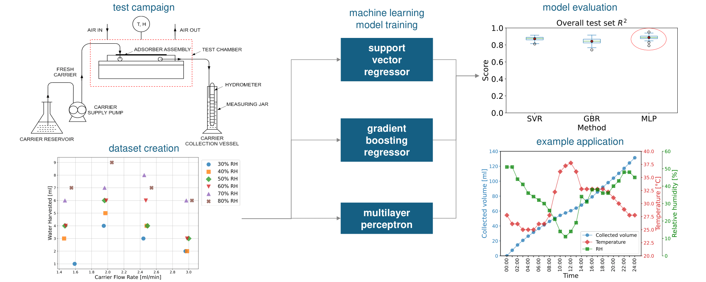

---

##### Download

+ [Code](https://github.com/giuliobarl/MLWaterHarvesting)
+ [Data](https://doi.org/10.5281/zenodo.10533012)

---

##### Abstract

This work investigates the performance of a novel membrane-based atmospheric water harvesting (AWH) unit under various operating conditions of ambient temperature, relative humidity (RH), and carrier fluid flow rate. Ion deposition membranes (IDMs) were selected for their ability to enhance water uptake by lowering the water vapor saturation pressure at the gas-membrane interface. This effect, achieved through metal ion implantation into PTFE-based membranes, improves water harvesting rates – especially under low RH conditions – by up to a factor of four compared to untreated membranes. The benchmark design was tested over all possible combinations of four distinct carrier fluid flow rates, three temperatures, and six RH values. The yield with a lab-scale prototype was as high as 354 ml/day of water, with an average of 155 ml/day, corresponding to water harvesting rates of 22.13 kg/m<sup>2</sup>/day and 9.69 kg/m<sup>2</sup>/day, respectively. The experimental dataset obtained was used to build three machine learning (ML) regression models to predict the amount of water harvested under specific operating conditions. The ML techniques are: Support Vector Regression, Gradient Boosting Regression, and Multilayer Perceptron. These methods achieved accuracy scores as high as 89%, proving suitable for implementation in the regulation of AWH plants featuring this technology. The best-performing model (Multilayer Perceptron) was used to predict the water harvesting potential on a typical spring day in Jeddah, Saudi Arabia, a region facing severe water scarcity.

---

##### Figure 1: Overview of the protocol used to train the ML models after the experimental campaign.



---

##### Citation

Barletta, G.; Moitra, S.; Derrible, S. ; Mathew, A. ; Nair, A. M. ; Megaridis, C. M. Exploring machine learning models to predict atmospheric water harvesting with an ion deposition membrane. J. Water Process Eng., 2025, https://doi.org/10.1016/j.jwpe.2025.107476

```BibTeX
@article{BARLETTA2025107476,
TITLE = {Exploring machine learning models to predict atmospheric water harvesting with an ion deposition membrane},
JOURNAL = {Journal of Water Process Engineering},
VOLUME = {72},
PAGES = {107476},
YEAR = {2025},
ISSN = {2214-7144},
DOI = {https://doi.org/10.1016/j.jwpe.2025.107476},
URL = {https://www.sciencedirect.com/science/article/pii/S2214714425005483},
AUTHOR = {Barletta, Giulio and Moitra, Shashwata and Derrible, Sybil and Mathew, Alex and Nair, Anoop Muraleedharan and Megaridis, Constantine M.},
KEYWORDS = {Machine learning, Atmospheric water harvesting, Membrane},
}
```
