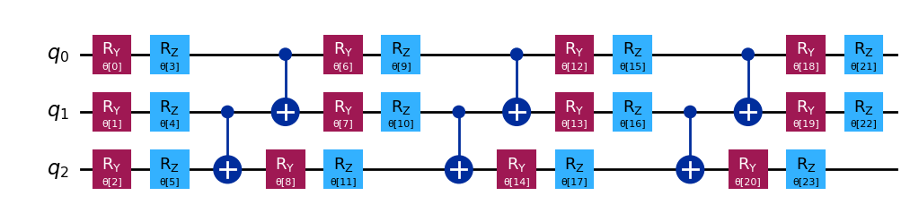

---

##### Download

+ [Paper](QuanTherm.pdf)

---

##### Abstract

This document explores the potential of quantum computing for solving linear systems of interest in engineering. In particular, we focus on heat conduction as a paradigmatic example in thermal science. Conceived as a living document, it will be continuously updated with experimental findings and insights for the research community in Thermal Science. By experiments, we refer both to the search for the most effective algorithms and to the performance of real quantum hardware. Those fields are currently evolving rapidly, driving a technological race to define the best architectures. The development of novel algorithms
for engineering problems aims at harnessing the unique strengths of quantum computing. Expectations are high, as users seek concrete evidence of quantum supremacy – a true game changer for engineering applications. Among all heat transfer mechanisms (conduction, convection, radiation), we start with conduction as a paradigmatic test case in the field being characterized by a rich mathematical foundation for our investigations.

---

##### Figure 1: Efficient ansatz (3 qubit, 24 parameters = four layers with six parameters each or, equivalently, eight parameters per qubit).



---

##### Citation

Asinari, P.; Alghamdi, N.; De Angelis, P.; Barletta, G.; Trezza, G.; Provenzano, M.; Piredda, M. M.; Fasano, M.; Chiavazzo, E "Notes on Quantum Computing for Thermal Science". arXiv May 13, 2025. https://doi.org/10.48550/arXiv.2503.19109.

```BibTeX
@misc{asinari_notes_2025,
	title = {Notes on {Quantum} {Computing} for {Thermal} {Science}},
	url = {http://arxiv.org/abs/2503.19109},
	doi = {10.48550/arXiv.2503.19109},
	urldate = {2025-05-14},
	publisher = {arXiv},
	author = {Asinari, Pietro and Alghamdi, Nada and Angelis, Paolo De and Barletta, Giulio and Trezza, Giovanni and Provenzano, Marina and Piredda, Matteo Maria and Fasano, Matteo and Chiavazzo, Eliodoro},
	month = may,
	year = {2025},
	note = {arXiv:2503.19109},
	keywords = {Physics - Computational Physics, Quantum Physics},
}
```