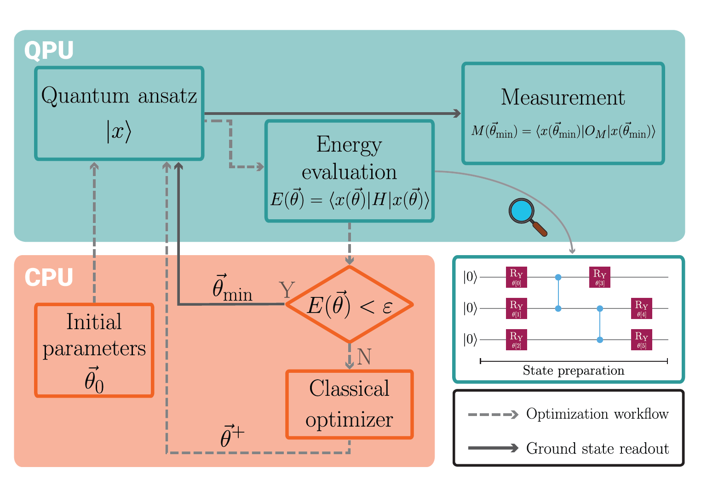

<!-- ---

##### Download

+ [Paper](QuanTherm.pdf)

--- -->

##### Abstract

The rapid development of quantum computing is creating new opportunities in thermal sciences for the exploration and simulation of heat and mass transfer phenomena, turbulent flows, as well as plasma and multiphase flows in porous media. In particular, high-fidelity simulations of turbulent flows could benefit from quantum computing through the acceleration of linear algebra solvers. However, the practical performance of current quantum computers remains limited. Major challenges include noise and fault tolerance—or, at least, effective error mitigation—as well as the development of improved quantum and hybrid quantum–classical algorithms, the tuning of algorithms for specific problem classes, and the management of both cloud-based platforms and physical quantum hardware. This work presents a case study on heat conduction as a paradigmatic test case to promote the exploration of quantum computing for thermal science. Innovative algorithmic strategies are discussed, supported by numerical and experimental case studies, and the performance of real quantum hardware (IQM Lagrange at Torino) is compared with classical computational methods. In particular, preliminary investigations on this quantum hardware yielded a mean nodal outcome error of up to 14% for the problem under consideration. In the current Noisy Intermediate-Scale Quantum (NISQ) era, these numerical results obtained on real quantum hardware are preliminary but provide valuable insights for guiding further hardware development, an effort that also requires advanced metrology. The paper highlights opportunities, current challenges, and future directions, with a particular emphasis on engineering applications.

---

##### Figure 1: Schematic representation of the key features of the VQE algorithm. The QPU denotes the quantum processing unit, while the CPU denotes the classical processing unit.



---

##### Citation

Pietro Asinari, Matteo Maria Piredda, Giulio Barletta, Paolo De Angelis, Nada Alghamdi, Giovanni Trezza, Marina Provenzano, Matteo Fasano, Eliodoro Chiavazzo,
Leveraging quantum computing for heat conduction analysis: A case study in thermal engineering,
Case Studies in Thermal Engineering,
2026,
107813,
ISSN 2214-157X,
https://doi.org/10.1016/j.csite.2026.107813.

```BibTeX
@article{ASINARI2026107813,
	title = {Leveraging quantum computing for heat conduction analysis: A case study in thermal engineering},
	journal = {Case Studies in Thermal Engineering},
	pages = {107813},
	year = {2026},
	issn = {2214-157X},
	doi = {https://doi.org/10.1016/j.csite.2026.107813},
	url = {https://www.sciencedirect.com/science/article/pii/S2214157X26001759},
	author = {Pietro Asinari and Matteo Maria Piredda and Giulio Barletta and Paolo {De Angelis} and Nada Alghamdi and Giovanni Trezza and Marina Provenzano and Matteo Fasano and Eliodoro Chiavazzo},
	keywords = {Quantum computing, Thermal engineering, Heat transfer, Quantum computing Variational quantum eigensolver, Real noisy quantum hardware, Quantum–classical comparison},
	abstract = {The rapid development of quantum computing is creating new opportunities in thermal sciences for the exploration and simulation of heat and mass transfer phenomena, turbulent flows, as well as plasma and multiphase flows in porous media. In particular, high-fidelity simulations of turbulent flows could benefit from quantum computing through the acceleration of linear algebra solvers. However, the practical performance of current quantum computers remains limited. Major challenges include noise and fault tolerance—or, at least, effective error mitigation—as well as the development of improved quantum and hybrid quantum–classical algorithms, the tuning of algorithms for specific problem classes, and the management of both cloud-based platforms and physical quantum hardware. This work presents a case study on heat conduction as a paradigmatic test case to promote the exploration of quantum computing for thermal science. Innovative algorithmic strategies are discussed, supported by numerical and experimental case studies, and the performance of real quantum hardware (IQM Lagrange at Torino) is compared with classical computational methods. In particular, preliminary investigations on this quantum hardware yielded a mean nodal outcome error of up to 14% for the problem under consideration. In the current Noisy Intermediate-Scale Quantum (NISQ) era, these numerical results obtained on real quantum hardware are preliminary but provide valuable insights for guiding further hardware development, an effort that also requires advanced metrology. The paper highlights opportunities, current challenges, and future directions, with a particular emphasis on engineering applications.}
}
```