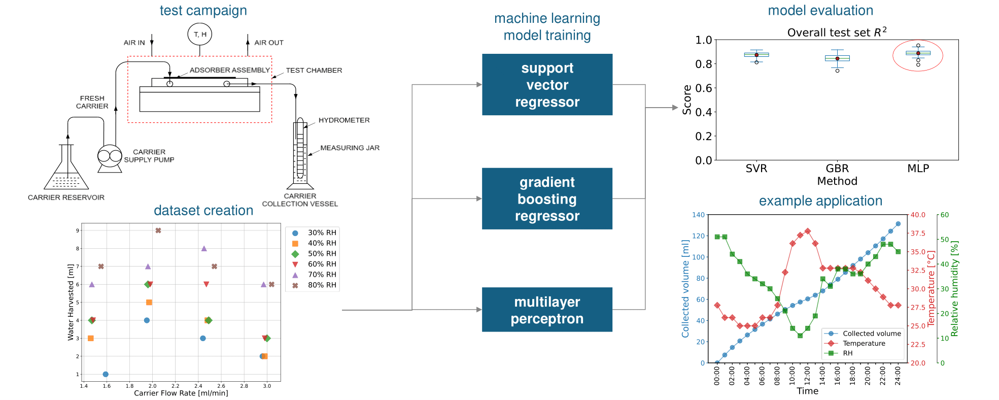

---

##### Related

+ [Online dataset](https://doi.org/10.5281/zenodo.10533012)

---

##### Description

This repository contains codes related to the publication "Exploring machine learning models to predict atmospheric water harvesting with an ion deposition membrane" (https://doi.org/10.1016/j.jwpe.2025.107476).
Datasets and trained models are published on our Zenodo repository (https://doi.org/10.5281/zenodo.10533012).

In particular:

- Folder `HP tuning` contains all `.ipynb` files for finding the optimal hyper-parameter combinations through grid-search optimization. Specifically, each file will run a grid-search optimization over 50 different and mutually exclusive splits of training and testing set. The optimal combination is chosen according to a majority vote strategy.
- `Model_comparison.ipynb` trains the ML models and compares their accuracy and stability.
- `Simulation.ipynb` makes predictions over real world data.

---

##### Overview of the protocol for creating the Energy-GNoME database.



---

##### Citation

Barletta, G.; Moitra, S.; Derrible, S. ; Mathew, A. ; Nair, A. M. ; Megaridis, C. M. Exploring machine learning models to predict atmospheric water harvesting with an ion deposition membrane. J. Water Process Eng., 2025, https://doi.org/10.1016/j.jwpe.2025.107476

```BibTeX
@article{BARLETTA2025107476,
TITLE = {Exploring machine learning models to predict atmospheric water harvesting with an ion deposition membrane},
JOURNAL = {Journal of Water Process Engineering},
VOLUME = {72},
PAGES = {107476},
YEAR = {2025},
ISSN = {2214-7144},
DOI = {https://doi.org/10.1016/j.jwpe.2025.107476},
URL = {https://www.sciencedirect.com/science/article/pii/S2214714425005483},
AUTHOR = {Barletta, Giulio and Moitra, Shashwata and Derrible, Sybil and Mathew, Alex and Nair, Anoop Muraleedharan and Megaridis, Constantine M.},
KEYWORDS = {Machine learning, Atmospheric water harvesting, Membrane},
}
```