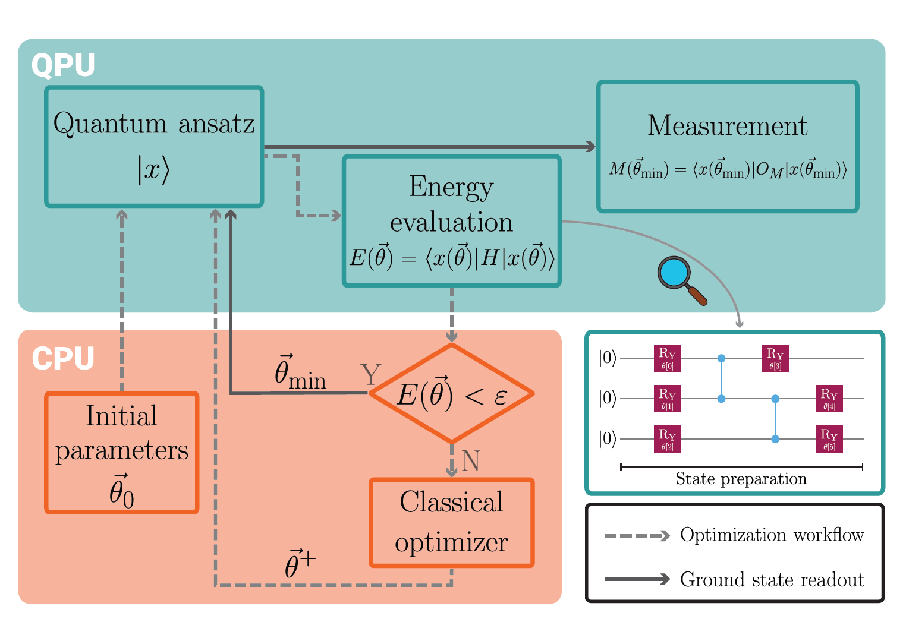

---

##### Related

+ [Paper](https://doi.org/10.1016/j.csite.2026.107813)

---

##### Description

This repository contains codes related to the publication "[Leveraging quantum computing for heat conduction analysis: A case study in thermal engineering](https://doi.org/10.1016/j.csite.2026.107813)". This document explores the potential of quantum computing for solving linear systems of interest in engineering. In particular, we focus on heat conduction as a paradigmatic example in thermal science.

##### Schematic representation of the key features of the VQE algorithm.



##### Citation

Asinari, Pietro, et al. "Leveraging quantum computing for heat conduction analysis: A case study in thermal engineering." Case Studies in Thermal Engineering (2026): 107813.

```BibTeX
@article{asinari2026leveraging,
  title={Leveraging quantum computing for heat conduction analysis: A case study in thermal engineering},
  author={Asinari, Pietro and Piredda, Matteo Maria and Barletta, Giulio and De Angelis, Paolo and Alghamdi, Nada and Trezza, Giovanni and Provenzano, Marina and Fasano, Matteo and Chiavazzo, Eliodoro},
  journal={Case Studies in Thermal Engineering},
  pages={107813},
  year={2026},
  publisher={Elsevier}
}
```