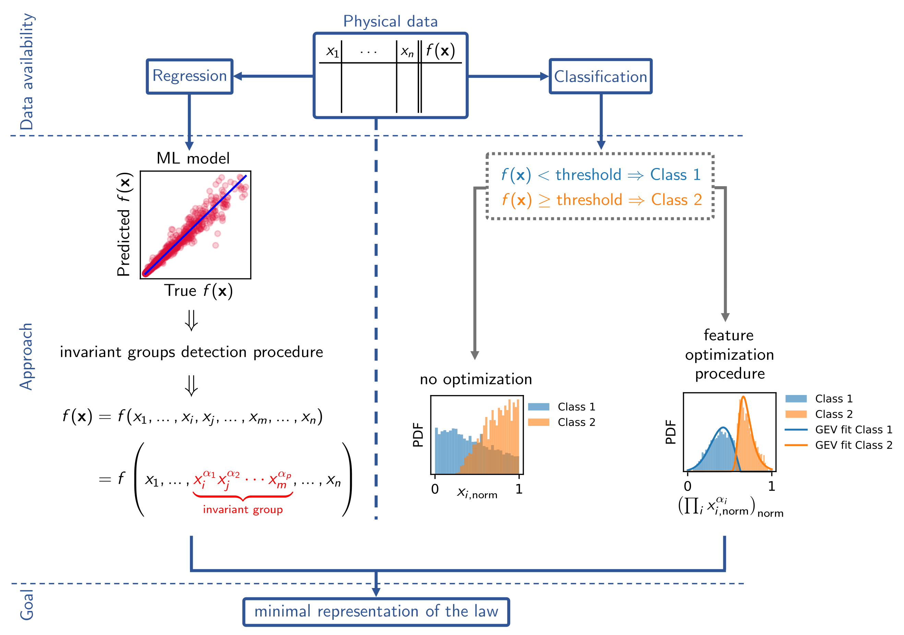

---

##### Related

+ [Paper](https://www.mdpi.com/2504-4990/6/3/77)
+ [Online dataset](https://doi.org/10.5281/zenodo.10406490)

---

##### Description

This repository contains codes related to the publication "Learning Effective Good Variables from Physical Data" (https://www.mdpi.com/2504-4990/6/3/77). Datasets and trained models are published on our Zenodo repository https://doi.org/10.5281/zenodo.10406490.

In particular:

* Folder `Classification` contains all `.m` files for finding the optimized mixed features with multi-objective optimization as product combination of the original features. Specifically, the file `MAIN.m` has to be run, deciding how many features to mix and how many mixed features to have in output (1 or 2). The selected threshold(s) and number of bins must be changed in the files `FeatureRoutine1d.m`, `FeatureRoutine1d3class.m`, `FeatureRoutine2d.m`, `DRAWFEATURE1D.m`, `DRAWFEATURE3class.m`, and `DRAWFEATURE2D.m`. Folder `Pareto fronts.m` contains already computed Pareto fronts for the examples shown in this work.
* Folder Regression contains the codes for the search of invariant groups in the form of:

    * product combinations of couples and triplets of variables (`Dittus_simple.py`, `Gniel_simple.py`);
    * sets of product combinations of couples of variables (`Couples.py`);
    * sets of product combinations of triplet and couple of variables (`Triple-couple.py`);
    * linear combinations of couples of variables (`Gravitational.py`).
    * File Coefficients_mixed_variables.xlsx contains the coefficients for mixing the original features according to the multi-objective optimization.

---

##### Overview of the protocol used to detect possible symmetries of a target property of interest with respect to its input variables.



---

##### Citation

Barletta, G.; Trezza, G.; Chiavazzo, E. Learning Effective Good Variables from Physical Data. Mach. Learn. Knowl. Extr. 2024, 6, 1597-1618. https://doi.org/10.3390/make6030077

```BibTeX
@Article{make6030077,
AUTHOR = {Barletta, Giulio and Trezza, Giovanni and Chiavazzo, Eliodoro},
TITLE = {Learning Effective Good Variables from Physical Data},
JOURNAL = {Machine Learning and Knowledge Extraction},
VOLUME = {6},
YEAR = {2024},
NUMBER = {3},
PAGES = {1597--1618},
URL = {https://www.mdpi.com/2504-4990/6/3/77},
ISSN = {2504-4990},
DOI = {10.3390/make6030077}
}
```