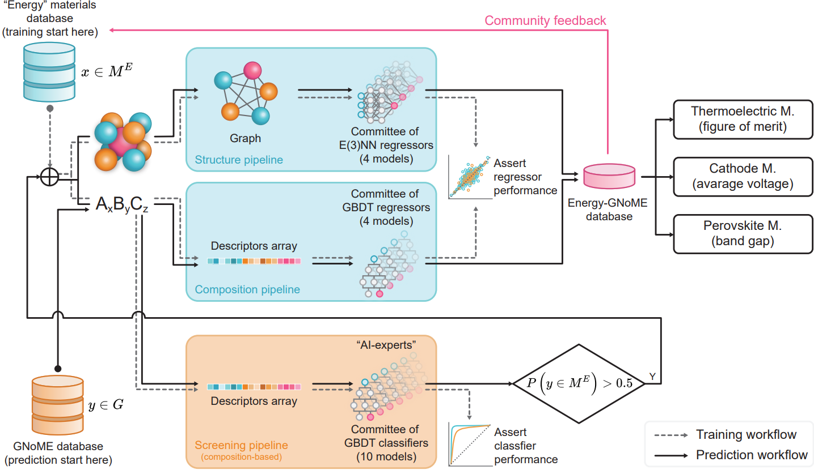

---

##### Related

+ [Paper](energy-gnome.pdf)
+ [Online interactive database](https://paolodeangelis.github.io/Energy-GNoME/)

---

##### Description

This repository contains the database, documentation, Python library (coming soon), and notebooks used to build the Energy-GNoME database.

The purpose of this repository is to enable reproducibility and, more importantly, to support the continuous integration of your data points for model training, as the database is designed as a living database.

For further details, refer to the associated article.

---

##### Overview of the protocol for creating the Energy-GNoME database.



---

##### Citation

De Angelis, P.; Trezza, G.; Barletta, G.; Asinari, P.; Chiavazzo, E. "Energy-GNoME: A Living Database of Selected Materials for Energy Applications". arXiv November 15, 2024. doi: 10.48550/arXiv.2411.10125.

```BibTeX
@misc{deangelis_energy-gnome:_2024,
    title = {Energy-{GNoME}: {A} {Living} {Database} of {Selected} {Materials} for {Energy} {Applications}},
    shorttitle = {Energy-{GNoME}},
    url = {http://arxiv.org/abs/2411.10125},
    doi = {10.48550/arXiv.2411.10125},
    urldate = {2024-12-03},
    publisher = {arXiv},
    author = {De Angelis, Paolo and Trezza, Giovanni and Barletta, Giulio and Asinari, Pietro and Chiavazzo, Eliodoro},
    month = nov,
    year = {2024},
    note = {arXiv:2411.10125},
    keywords = {Condensed Matter - Materials Science, Condensed Matter - Other Condensed Matter, Computer Science - Machine Learning},
}
```